# Project Component Dependency Graph

This document serves as a reference graph of import dependencies across files in this project. Use this list to trace how changes in a utility or service ripple through the application.

---

## 1. Visual Graph (Mermaid Flowchart)

```mermaid
graph TD
  main[src/main.tsx] --> App[src/App.tsx]
  
  %% Public Views
  App --> Home[src/pages/Home.tsx]
  App --> Art[src/pages/ArtWeeb.tsx]
  App --> Blog[src/pages/Blog.tsx]
  App --> SystemSet[src/pages/SystemSettings.tsx]
  App --> Boot[src/components/BootScreen.tsx]
  
  %% Admin Shell & Middleware
  App --> Login[src/pages/Admin/Login.tsx]
  App --> Guard[src/middleware/ProtectedRoute.tsx]
  App --> AdminLayout[src/components/admin/AdminLayout.tsx]
  
  %% Admin Views
  AdminLayout --> Dash[src/pages/Admin/Dashboard.tsx]
  AdminLayout --> APosts[src/pages/Admin/Posts.tsx]
  AdminLayout --> AProjs[src/pages/Admin/Projects.tsx]
  AdminLayout --> AMedia[src/pages/Admin/Media.tsx]
  AdminLayout --> ASettings[src/pages/Admin/Settings.tsx]
  AdminLayout --> ALogs[src/pages/Admin/Logs.tsx]
  
  %% Admin Reusable Sub-components
  APosts --> Toast[src/components/admin/Toast.tsx]
  APosts --> Dialog[src/components/admin/ConfirmationDialog.tsx]
  AProjs --> Toast
  AProjs --> Dialog
  AMedia --> Toast
  AMedia --> Dialog
  ASettings --> Toast
  ASettings --> Dialog
  ALogs --> Toast

  %% Data & Service Layer
  Home --> ProjServ[src/services/projects.ts]
  Blog --> PostServ[src/services/posts.ts]
  
  Login --> AuthServ[src/services/auth.ts]
  Guard --> AuthServ
  AdminLayout --> AuthServ
  Dash --> AuthServ
  ASettings --> AuthServ
  ALogs --> AuthServ
  
  APosts --> PostServ
  APosts --> Blog
  
  AProjs --> ProjServ
  AMedia --> MediaServ[src/services/media.ts]
  
  %% Cross-cutting utilities
  Home --> Sound[src/components/SoundController.ts]
  Art --> Sound
  Blog --> Sound
  SystemSet --> Sound
  Boot --> Sound
  Login --> Sound
  AdminLayout --> Sound
  Dialog --> Sound
  Dash --> Sound
  APosts --> Sound
  AProjs --> Sound
  AMedia --> Sound
  ASettings --> Sound
  ALogs --> Sound

  Home --> Glitch[src/components/GlitchText.tsx]
```

---

## 2. File Dependency Matrix

### `src/components/SoundController.ts`
* **Depends On**: None (Web Audio API native browser oscillators).
* **Imported By**:
  * [src/main.tsx](file:///c:/Users/devda/OneDrive/Desktop/portfolio-blog/src/main.tsx)
  * [src/App.tsx](file:///c:/Users/devda/OneDrive/Desktop/portfolio-blog/src/App.tsx)
  * [src/components/BootScreen.tsx](file:///c:/Users/devda/OneDrive/Desktop/portfolio-blog/src/components/BootScreen.tsx)
  * [src/pages/Home.tsx](file:///c:/Users/devda/OneDrive/Desktop/portfolio-blog/src/pages/Home.tsx)
  * [src/pages/ArtWeeb.tsx](file:///c:/Users/devda/OneDrive/Desktop/portfolio-blog/src/pages/ArtWeeb.tsx)
  * [src/pages/Blog.tsx](file:///c:/Users/devda/OneDrive/Desktop/portfolio-blog/src/pages/Blog.tsx)
  * [src/pages/SystemSettings.tsx](file:///c:/Users/devda/OneDrive/Desktop/portfolio-blog/src/pages/SystemSettings.tsx)
  * [src/pages/Admin/Login.tsx](file:///c:/Users/devda/OneDrive/Desktop/portfolio-blog/src/pages/Admin/Login.tsx)
  * [src/pages/Admin/Dashboard.tsx](file:///c:/Users/devda/OneDrive/Desktop/portfolio-blog/src/pages/Admin/Dashboard.tsx)
  * [src/pages/Admin/Posts.tsx](file:///c:/Users/devda/OneDrive/Desktop/portfolio-blog/src/pages/Admin/Posts.tsx)
  * [src/pages/Admin/Projects.tsx](file:///c:/Users/devda/OneDrive/Desktop/portfolio-blog/src/pages/Admin/Projects.tsx)
  * [src/pages/Admin/Media.tsx](file:///c:/Users/devda/OneDrive/Desktop/portfolio-blog/src/pages/Admin/Media.tsx)
  * [src/pages/Admin/Settings.tsx](file:///c:/Users/devda/OneDrive/Desktop/portfolio-blog/src/pages/Admin/Settings.tsx)
  * [src/pages/Admin/Logs.tsx](file:///c:/Users/devda/OneDrive/Desktop/portfolio-blog/src/pages/Admin/Logs.tsx)
  * [src/components/admin/AdminLayout.tsx](file:///c:/Users/devda/OneDrive/Desktop/portfolio-blog/src/components/admin/AdminLayout.tsx)
  * [src/components/admin/ConfirmationDialog.tsx](file:///c:/Users/devda/OneDrive/Desktop/portfolio-blog/src/components/admin/ConfirmationDialog.tsx)

### `src/services/auth.ts`
* **Depends On**: `bcryptjs`
* **Imported By**:
  * [src/middleware/ProtectedRoute.tsx](file:///c:/Users/devda/OneDrive/Desktop/portfolio-blog/src/middleware/ProtectedRoute.tsx)
  * [src/components/admin/AdminLayout.tsx](file:///c:/Users/devda/OneDrive/Desktop/portfolio-blog/src/components/admin/AdminLayout.tsx)
  * [src/pages/Admin/Login.tsx](file:///c:/Users/devda/OneDrive/Desktop/portfolio-blog/src/pages/Admin/Login.tsx)
  * [src/pages/Admin/Dashboard.tsx](file:///c:/Users/devda/OneDrive/Desktop/portfolio-blog/src/pages/Admin/Dashboard.tsx)
  * [src/pages/Admin/Settings.tsx](file:///c:/Users/devda/OneDrive/Desktop/portfolio-blog/src/pages/Admin/Settings.tsx)
  * [src/pages/Admin/Logs.tsx](file:///c:/Users/devda/OneDrive/Desktop/portfolio-blog/src/pages/Admin/Logs.tsx)

### `src/services/posts.ts`
* **Depends On**: `src/services/auth.ts`
* **Imported By**:
  * [src/pages/Blog.tsx](file:///c:/Users/devda/OneDrive/Desktop/portfolio-blog/src/pages/Blog.tsx)
  * [src/pages/Admin/Posts.tsx](file:///c:/Users/devda/OneDrive/Desktop/portfolio-blog/src/pages/Admin/Posts.tsx)

### `src/services/projects.ts`
* **Depends On**: `src/services/auth.ts`
* **Imported By**:
  * [src/pages/Home.tsx](file:///c:/Users/devda/OneDrive/Desktop/portfolio-blog/src/pages/Home.tsx)
  * [src/pages/Admin/Projects.tsx](file:///c:/Users/devda/OneDrive/Desktop/portfolio-blog/src/pages/Admin/Projects.tsx)

### `src/services/media.ts`
* **Depends On**: `src/services/auth.ts`
* **Imported By**:
  * [src/pages/Admin/Media.tsx](file:///c:/Users/devda/OneDrive/Desktop/portfolio-blog/src/pages/Admin/Media.tsx)

### `src/middleware/ProtectedRoute.tsx`
* **Depends On**: `src/services/auth.ts`
* **Imported By**:
  * [src/App.tsx](file:///c:/Users/devda/OneDrive/Desktop/portfolio-blog/src/App.tsx)

### `src/components/admin/AdminLayout.tsx`
* **Depends On**: `src/services/auth.ts`, `src/components/SoundController.ts`
* **Imported By**:
  * [src/App.tsx](file:///c:/Users/devda/OneDrive/Desktop/portfolio-blog/src/App.tsx)

### `src/pages/Blog.tsx`
* **Depends On**: `src/services/posts.ts`, `src/components/SoundController.ts`, `marked`, `katex`, `highlight.js`
* **Imported By**:
  * [src/App.tsx](file:///c:/Users/devda/OneDrive/Desktop/portfolio-blog/src/App.tsx)
  * [src/pages/Admin/Posts.tsx](file:///c:/Users/devda/OneDrive/Desktop/portfolio-blog/src/pages/Admin/Posts.tsx) (imports `renderMarkdownToHtml` compiler helper)
